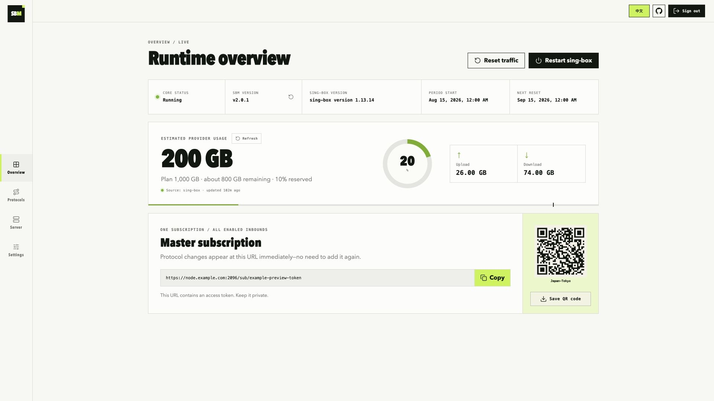
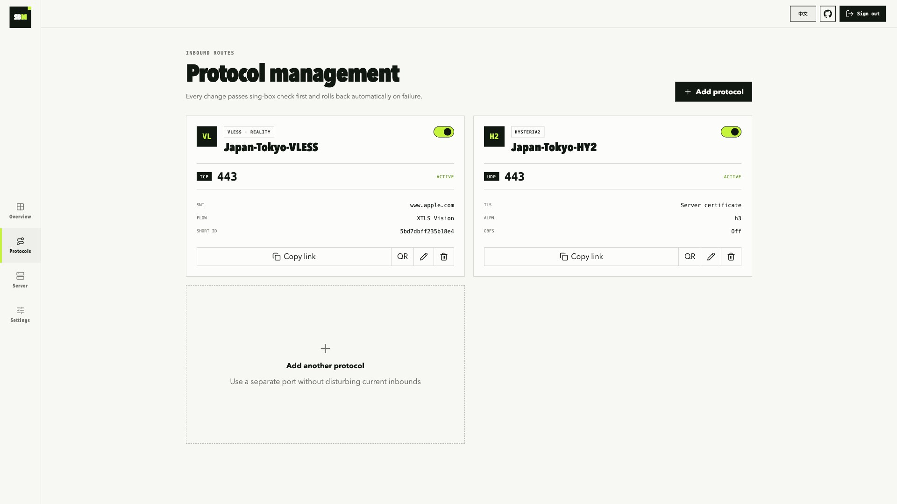

# SBM

[简体中文](README.zh-CN.md) | English

SBM is a small web panel for one sing-box server. It is meant for a personal VPS, not a multi-node or multi-user service.

A fresh install starts two inbounds:

- VLESS + Vision + REALITY on TCP/443
- Hysteria2 on UDP/443

The panel gives you one subscription URL for all enabled inbounds.

## Install

The current SBM 2.x build uses a new v3 configuration and supports fresh installations only. It deliberately does not migrate or partially read older configuration files; back up the old installation and deploy with a new configuration.

You need a Debian or Ubuntu VPS running on amd64 or arm64. Before you install:

1. Create an A record pointing your domain to the VPS public IPv4 address.
2. If the domain uses Cloudflare, set the record to **DNS only** (grey cloud).
3. Allow these ports in the cloud firewall or security group:

| Port | Protocol | Used by |
| --- | --- | --- |
| 80 | TCP | Let's Encrypt certificate issuance and renewal |
| 443 | TCP | VLESS Reality |
| 443 | UDP | Hysteria2 |
| 2096 | TCP | Web panel and subscription |

TCP/2096 is only the default panel port. If you choose another one during installation, open that port instead.

Run this in two steps. First switch to root:

```bash
sudo -i
```

Skip this step if you are already in a root shell. Then run the installer:

```bash
bash <(curl -fsSL https://raw.githubusercontent.com/boltguo/sbm/main/install.sh)
```

The installer pins both SBM and sing-box to a tested release pair. It does not silently switch to a newer sing-box when upstream publishes one. To install a specific published SBM version, use the current installer with `SBM_VERSION`:

```bash
SBM_VERSION=2.0.1 bash <(curl -fsSL https://raw.githubusercontent.com/boltguo/sbm/main/install.sh)
```

The installer selects the sing-box version tested with that SBM release. `SING_BOX_VERSION` can override the core version for troubleshooting or testing, but an untested combination can fail configuration validation. SBM 2.x is fresh-install only and does not provide old-config migration or old SBM release mappings.

The installer asks for:

```text
Domain: node.example.com
面板端口 [2096]:
节点名称 [JP-Tokyo]:
```

The prompts are in Chinese and ask for the domain, the panel port, and the node name. Press Enter to keep port 2096. The suggested node name comes from the server's public IP and uses the two-letter country code plus city, such as `JP-Tokyo`, `SG-Singapore`, or `US-Boardman`; the generated nodes add the `-VLESS` and `-HY2` suffixes. At the end the installer prints the panel address, the `admin` username, a random password, and the subscription URL.

Installation aborts if TCP/80, TCP/443, UDP/443, or the panel port is already in use. Once the services start, the script checks the listeners and makes a local HTTPS request to the panel.

UFW, firewalld, and iptables inside the VPS are handled automatically, and existing iptables rules are kept. Cloud firewalls sit outside the VPS and must be configured in the provider console.

Open the panel at:

```text
https://node.example.com:2096/
```

If you forget the password, run `sudo sbm` and choose `Reset administrator password`.

### Cloud firewall and VPS compatibility

Use a fixed public IPv4 address when the provider offers one, then point the domain directly at it. Remove a stale AAAA record unless IPv6 is fully configured. Keep outbound traffic allowed: certificate issuance, updates, DNS, and proxy forwarding all need it.

The four inbound rules in the installation table are separate rules. In particular, an `HTTPS/443` preset normally opens TCP only; Hysteria2 still needs UDP/443. The panel and subscription share the panel port. If you restrict that port by source address, include every phone and computer that needs to refresh the subscription. Clash API remains local on `127.0.0.1:9090` and must not be exposed.

| Provider | Setting commonly missed |
| --- | --- |
| Oracle Cloud (OCI) | Check the VNIC's NSG or subnet Security List and the image firewall; ZPR also needs an allow policy when enabled. |
| AWS EC2 | Apply the Security Group to the actual ENI. A custom Network ACL is stateless and must also allow response traffic. Use an Elastic IP to survive Stop/Start. |
| AWS Lightsail | IPv4 and IPv6 firewalls are independent. Attach a Static IP before relying on the DNS record. |
| Google Cloud | The allow rule must target the VM's VPC/tag/service account and outrank deny policies. Promote an ephemeral external IP to static. |
| Microsoft Azure | Both subnet and NIC NSGs must allow the traffic; lower priority numbers run first. Use a Static Public IP. |
| Alibaba Cloud / Tencent Cloud | Check all attached security groups, rule order, and outbound policy; predefined HTTPS rules do not add UDP/443. |
| DigitalOcean / Hetzner / Vultr / Linode | Creating a firewall rule is not enough—confirm that the firewall is enabled and attached to the instance or label. |
| DMIT and other KVM providers | Some products add a provider-side firewall. Treat it as a separate layer from UFW/firewalld/iptables. |

An operating-system `reboot` normally keeps the public IP. Provider-console Stop/Start or Deallocate can change a dynamic IP on EC2, Lightsail, GCP, or Azure, leaving DNS pointed at the old address. The installer checks DNS during a fresh installation but does not modify third-party DNS.

## Screenshots

### Overview



### Protocols



## What the panel does

- Chinese and English UI, with a manual language switch
- SBM and sing-box versions, panel update checks, provider-plan traffic estimates, reset period, and subscription QR code
- Server Health with CPU, load, memory, disk, uptime, service/configuration checks, TLS expiry, TCP/UDP listeners, sampling state, and reset schedule
- Add, edit, enable, disable, and delete VLESS Reality or Hysteria2 inbounds
- Copy a single-node URL or display its QR code
- Automatic UUID, Reality key pair, short ID, and Hysteria2 password generation
- Manual traffic reset or monthly reset on days 1–28
- Automatic, prefer IPv4, prefer IPv6, IPv4-only, or IPv6-only proxy egress strategy
- Automatic sing-box validation and rollback when a protocol change fails

### Traffic plans and quota

`Settings → Plan traffic and period` always uses GB. Enter `1000 GB` for 1 TB or `500 GB` for 500 GB.

If the provider explicitly uses GiB, convert it with `GiB × 1.073741824`, or enter the same number and lower the safety reserve if needed.

Select two-way for a two-way plan; do not divide the allowance yourself.

Set the allowance to `0` for unlimited traffic. For a limited plan, sing-box stops when the configured safety threshold is reached and resumes after a manual or scheduled traffic reset, or after the plan is increased.

### IPv4 / IPv6 egress

Choose an address-family strategy under `Settings → Proxy egress network`. If IPv6 has more accurate geolocation, use **Prefer IPv6**: sing-box prefers IPv6 for destinations with AAAA records and falls back to IPv4 when needed. IPv6-only makes IPv4-only destinations unreachable.

This setting requires sing-box 1.12 or newer and only affects domain destinations received by sing-box. The server cannot switch address family after a client has already resolved a domain to an IP. IPv6 client access also requires a correct AAAA record and matching rules in both the cloud and host firewalls.

### Server Health and diagnostics

The Server page is read-only. It normally shows only the number of passed checks, expands warning, error, or unknown items when attention is needed, and still offers a view of every result. It checks the sing-box service and configuration, traffic sampling, TLS certificate expiry, the panel and enabled inbound listeners with TCP/UDP kept distinct, root-disk thresholds, and the next traffic reset. A planned quota pause does not misreport intentionally stopped inbounds as failures. Configuration and certificate checks use a short cache, while listener state is read live.

The page returns only structured health fields and never exposes passwords, session secrets, subscription tokens, UUIDs, private keys, complete configuration, or raw command output. DNS/public-IP matching is intentionally left out because valid multi-record, IPv6, and NAT setups cannot be judged reliably from the host alone.

## Manage SBM from the terminal

```bash
sudo sbm
```

The menu includes:

1. Show panel URL and service status
2. Restart the panel
3. Restart sing-box
4. Reset the administrator password
5. View logs
6. Update the panel
7. Install or restore the compatible sing-box version
8. Back up configuration
9. Restore configuration
10. Uninstall
11. Repair boot services and host firewall
12. Lock or unlock the Web management entry while keeping subscriptions available

Backups are saved in `/root`. Downloads verify the SHA-256 digest from GitHub Releases. Panel updates select the latest SBM Release, while option 7 installs the sing-box version pinned to the currently installed SBM release. If a replacement binary fails configuration validation or its health check, the previously installed binary is restored.

Protocol and egress changes are transactional: SBM writes a candidate, runs `sing-box check`, starts the result, and restores the previous business configuration and generated core configuration if validation or startup fails.

The version card on the Overview page checks the latest GitHub Release and shows a red dot when an update is available. To install it, connect over SSH, run `sudo sbm`, and choose option 6.

Successful, failed, and rate-limited sign-in attempts are recorded in the systemd journal:

```bash
journalctl -u sbm-panel -g 'audit event=login'
```

The panel manages host services, so do not expose its port more widely than needed. Subscriptions share that port, so a source-IP restriction must allow every device that updates the subscription.

If you rarely change settings, choose option 12 in `sudo sbm` to lock the Web UI, login, and management API. Existing `/sub/...` URLs remain available; run the same option over SSH to unlock management.

## Adding another inbound

Open the Protocols page, choose a protocol and port, and apply the change. New ports also need a matching TCP or UDP rule in the cloud firewall.

The master subscription URL does not change when inbounds are added, edited, disabled, or removed. Regenerating its token in Settings invalidates the old URL.

## Troubleshooting

Panel status and logs:

```bash
systemctl status sbm-panel --no-pager
journalctl -u sbm-panel -e --no-pager
```

sing-box status and configuration check:

```bash
/usr/local/bin/sing-box check -c /etc/sing-box/config.json
systemctl status sing-box --no-pager
journalctl -u sing-box -e --no-pager
```

If certificate issuance fails, check the A record, Cloudflare grey-cloud mode, TCP/80, and whether another process is already using port 80.

If a service is unreachable, confirm the rule is attached to this exact cloud instance, then check both TCP and UDP listeners:

```bash
sudo ss -lntp
sudo ss -lnup
```

Run `sudo sbm` and choose option 11 to restore the host-firewall rules and boot services. This cannot change a provider firewall. Test the panel from another network with `curl -vk https://your-domain.example:panel-port/`; if no packet reaches the VPS, investigate DNS, the cloud firewall, Network ACL, or upstream filtering before reinstalling.

The message `debconf: delaying package configuration, since apt-utils is not installed` is normal on minimal Debian images.

## License

See [LICENSE](LICENSE).
