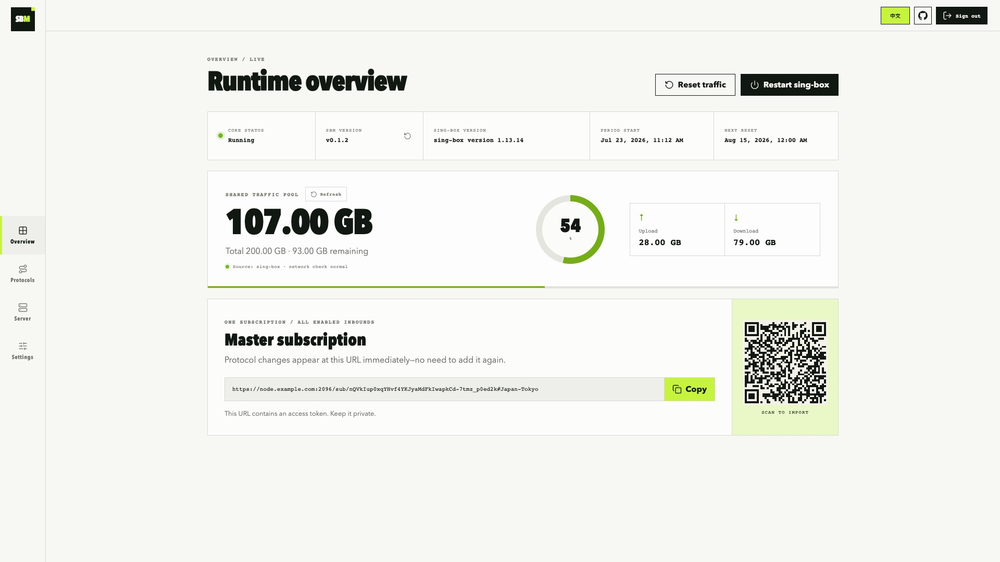
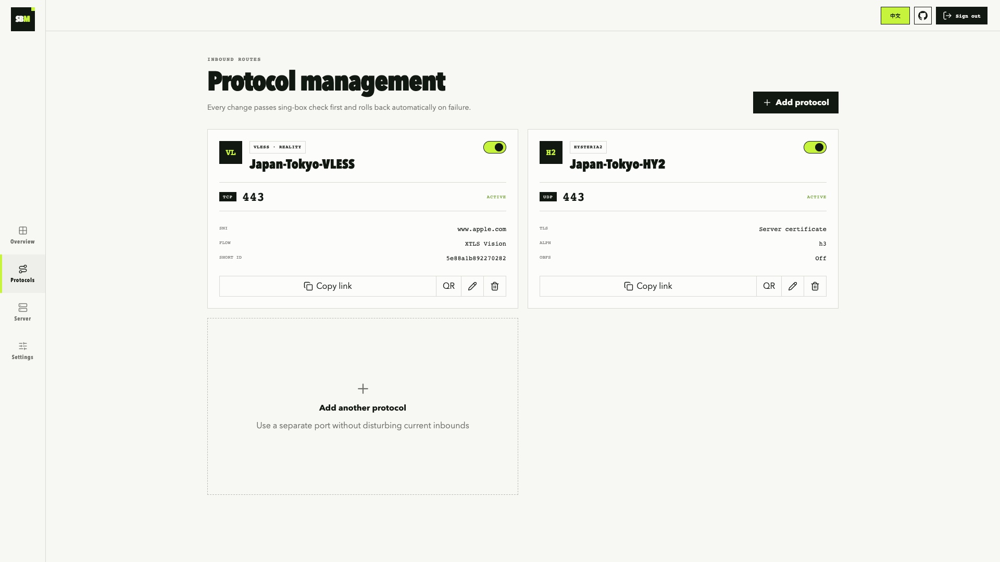

# SBM

[简体中文](README.zh-CN.md) | English

SBM is a small web panel for one sing-box server. It is meant for a personal VPS, not a multi-node or multi-user service.

A fresh install starts two inbounds:

- VLESS + Vision + REALITY on TCP/443
- Hysteria2 on UDP/443

The panel gives you one subscription URL for all enabled inbounds.

## Install

You need a Debian or Ubuntu VPS running on amd64 or arm64. Before you install:

1. Create an A record pointing your domain to the VPS public IPv4 address.
2. If the domain uses Cloudflare, set the record to **DNS only** (grey cloud).
3. Allow these ports in the cloud firewall or security group:

| Port | Protocol | Used by |
| --- | --- | --- |
| 80 | TCP | Let's Encrypt certificate issuance and renewal |
| 443 | TCP | VLESS Reality |
| 443 | UDP | Hysteria2 |
| 2096 | TCP | Web panel and subscription |

TCP/2096 is only the default panel port. If you choose another one during installation, open that port instead.

Run this in two steps. First switch to root:

```bash
sudo -i
```

Skip this step if you are already in a root shell. Then run the installer:

```bash
bash <(curl -fsSL https://raw.githubusercontent.com/boltguo/sbm/main/install.sh)
```

The installer asks for:

```text
Domain: node.example.com
面板端口 [2096]:
节点名称 [JP-Tokyo]:
```

The prompts are in Chinese and ask for the domain, the panel port, and the node name. Press Enter to keep port 2096. The suggested node name comes from the server's public IP and uses the two-letter country code, producing `JP-Tokyo-VLESS` and `JP-Tokyo-HY2`. At the end the installer prints the panel address, the `admin` username, a random password, and the subscription URL.

Installation aborts if TCP/80, TCP/443, UDP/443, or the panel port is already in use. Once the services start, the script checks the listeners and makes a local HTTPS request to the panel.

UFW, firewalld, and iptables inside the VPS are handled automatically, and existing iptables rules are kept. Cloud firewalls sit outside the VPS and the script cannot change them; the [VPS firewall guide](docs/VPS-COMPATIBILITY.en.md) has the console paths for OCI, AWS, GCP, Azure, Alibaba Cloud, Tencent Cloud, and other common providers.

Open the panel at:

```text
https://node.example.com:2096/
```

If you forget the password, run `sudo sbm` and choose `Reset administrator password`.

## Screenshots

### Overview



### Protocols



## What the panel does

- Chinese and English UI, with a manual language switch
- SBM and sing-box versions, panel update checks, traffic usage, quota, reset period, and subscription QR code
- CPU, load, memory, disk, uptime, OS, kernel, and architecture status
- Add, edit, enable, disable, and delete VLESS Reality or Hysteria2 inbounds
- Copy a single-node URL or display its QR code
- Automatic UUID, Reality key pair, short ID, and Hysteria2 password generation
- Manual traffic reset or monthly reset on days 1–28
- Automatic, prefer IPv4, prefer IPv6, IPv4-only, or IPv6-only proxy egress strategy
- Same-port WireGuard IPv4 companion nodes for each protocol, with no WireGuard package on A
- Automatic sing-box validation and rollback when a protocol change fails

### IPv4 / IPv6 egress

Choose an address-family strategy under `Settings → Proxy egress network`. If IPv6 has more accurate geolocation, use **Prefer IPv6**: sing-box prefers IPv6 for destinations with AAAA records and falls back to IPv4 when needed. IPv6-only makes IPv4-only destinations unreachable.

This setting requires sing-box 1.12 or newer and only affects domain destinations received by sing-box. The server cannot switch address family after a client has already resolved a domain to an IP. IPv6 client access also requires a correct AAAA record and matching rules in both the cloud and host firewalls.

### WireGuard exit node

Starting with v1.2.0, configure B under `Settings → WireGuard companion nodes`. With the switch off, the subscription contains only the original direct nodes. Turning it on adds a separate credential on the same domain and port for every enabled protocol, such as `DMIT VLESS · via GCP` and `DMIT HY2 · via GCP`. Original direct nodes always remain.

Companion credentials are routed by authenticated user to the userspace WireGuard endpoint and resolve domain targets as IPv4. Other nodes continue to use the address-family strategy under `Proxy egress network` and leave directly through A. Turning the switch off hides the companion credentials from sing-box and the subscription without discarding their UUIDs or passwords.

The panel can generate A's WireGuard keypair. A's internal tunnel address (`10.66.0.2/32`), MTU (`1408`), and keepalive (`25s`) are built in. B still needs WireGuard, IPv4 forwarding, NAT, and a cloud firewall rule allowing the UDP port from A. If B or the tunnel fails, only the `via GCP` nodes stop working; clients can switch directly to the original nodes.

## Manage SBM from the terminal

```bash
sudo sbm
```

The menu includes:

1. Show panel URL and service status
2. Restart the panel
3. Restart sing-box
4. Reset the administrator password
5. View logs
6. Update the panel
7. Update sing-box
8. Back up configuration
9. Restore configuration
10. Uninstall
11. Repair boot services and host firewall

Backups are saved in `/root`. Updates verify the SHA-256 digest from GitHub Releases. If the new binary fails its health check, the old one is restored.

The version card on the Overview page checks the latest GitHub Release and shows a red dot when an update is available. To install it, connect over SSH, run `sudo sbm`, and choose option 6.

Successful, failed, and rate-limited sign-in attempts are recorded in the systemd journal:

```bash
journalctl -u sbm-panel -g 'audit event=login'
```

The panel manages host services, so do not expose its port more widely than needed. Subscriptions share that port, so a source-IP restriction must allow every device that updates the subscription.

## Adding another inbound

Open the Protocols page, choose a protocol and port, and apply the change. New ports also need a matching TCP or UDP rule in the cloud firewall.

The master subscription URL does not change when inbounds are added, edited, disabled, or removed. Regenerating its token in Settings invalidates the old URL.

## Troubleshooting

Panel status and logs:

```bash
systemctl status sbm-panel --no-pager
journalctl -u sbm-panel -e --no-pager
```

sing-box status and configuration check:

```bash
/usr/local/bin/sing-box check -c /etc/sing-box/config.json
systemctl status sing-box --no-pager
journalctl -u sing-box -e --no-pager
```

If certificate issuance fails, check the A record, Cloudflare grey-cloud mode, TCP/80, and whether another process is already using port 80.

The message `debconf: delaying package configuration, since apt-utils is not installed` is normal on minimal Debian images.

## License

See [LICENSE](LICENSE).
