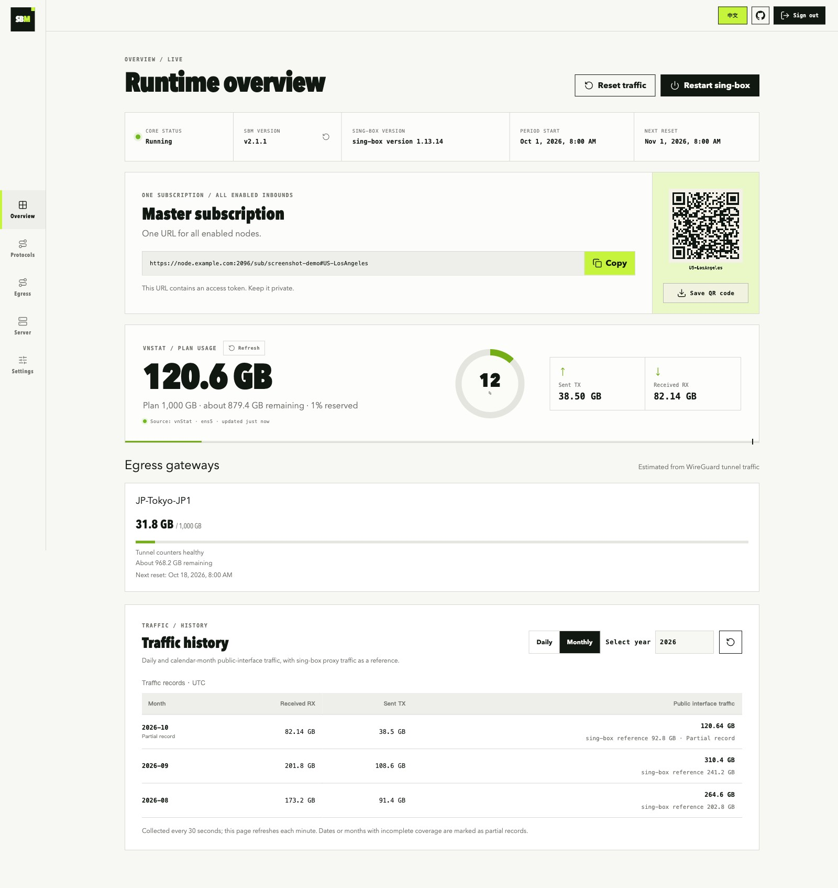
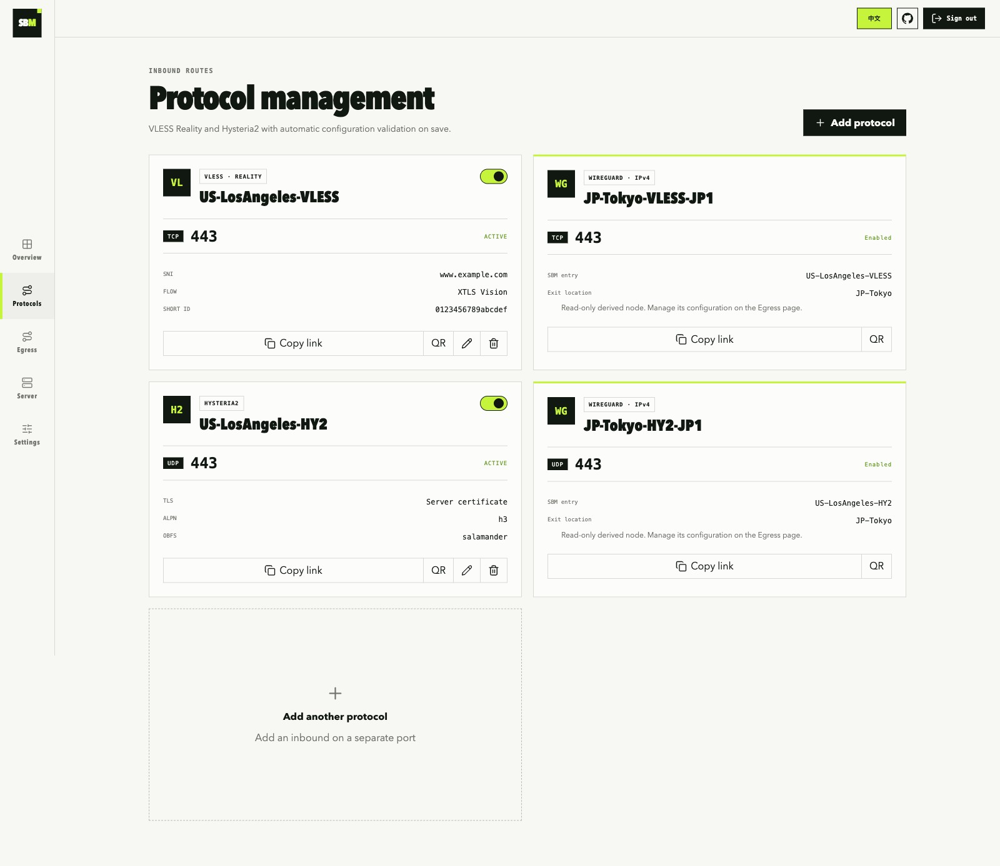

# SBM

[简体中文](README.zh-CN.md) | English

SBM is a small web panel for managing one sing-box server on a personal VPS.

A fresh install starts two inbounds:

- VLESS + Vision + REALITY on TCP/443
- Hysteria2 on UDP/443

The panel gives you one subscription URL for all enabled inbounds.

## Multiple WireGuard egress gateways

The Egress page manages optional gateways while keeping one master subscription. Independent VLESS UUIDs / HY2 passwords select Direct or a gateway on the same entry domain and protocol ports. Direct nodes are always available.

For example, `US-LosAngeles-VLESS` leaves through entry A, while `US-Boardman-VLESS-AWS` leaves through AWS B over WireGuard. Each gateway keeps its own location, marker, plan, reset schedule, and traffic baselines. Gateway plans only warn; entry quota enforcement uses the entry public interface’s vnStat counters. Exit usage is estimated from WireGuard tunnel counters on A.

See [multi-gateway WireGuard setup and troubleshooting](docs/WIREGUARD-EXIT.en.md). Direct and gateway nodes share the master subscription. Conflicting node names receive a port and short identifier before the final marker. Display-order changes take effect immediately.

## Install

The panel supports web and CLI updates, retaining configuration and traffic history.

You need a Debian or Ubuntu VPS running on amd64 or arm64. Before you install:

1. Create an A record pointing your domain to the VPS public IPv4 address.
2. If the domain uses Cloudflare, set the record to **DNS only** (grey cloud).
3. Allow these ports in the cloud firewall or security group:

| Port | Protocol | Used by |
| --- | --- | --- |
| 80 | TCP | Let's Encrypt certificate issuance and renewal |
| 443 | TCP | VLESS Reality |
| 443 | UDP | Hysteria2 |
| 2096 | TCP | Web panel and subscription |

TCP/2096 is only the default panel port. If you choose another one during installation, open that port instead.

Run this in two steps. First switch to root:

```bash
sudo -i
```

Skip this step if you are already in a root shell. Then run the installer:

```bash
bash <(curl -fsSL https://raw.githubusercontent.com/boltguo/sbm/main/install.sh)
```

The installer uses a tested SBM and sing-box release pair. To install a specific published SBM version, set `SBM_VERSION`:

```bash
SBM_VERSION=2.1.2 bash <(curl -fsSL https://raw.githubusercontent.com/boltguo/sbm/main/install.sh)
```

The installer supports SBM 2.1 and later 2.x releases and selects the sing-box version tested with that release. Use `SING_BOX_VERSION` to specify a core version for troubleshooting or testing.

The installer asks for:

```text
Domain: node.example.com
面板端口 [2096]:
节点名称 [JP-Tokyo]:
```

The prompts are in Chinese and ask for the domain, the panel port, and the node name. Press Enter to keep port 2096. The suggested node name comes from the server's public IP and uses the two-letter country code plus city, such as `JP-Tokyo`, `SG-Singapore`, or `US-Boardman`; the generated nodes add the `-VLESS` and `-HY2` suffixes. At the end the installer prints the panel address, the `admin` username, a random password, and the subscription URL.

Installation aborts if TCP/80, TCP/443, UDP/443, or the panel port is already in use. Once the services start, the script checks the listeners and makes a local HTTPS request to the panel.

UFW, firewalld, and iptables inside the VPS are handled automatically, and existing iptables rules are kept. Cloud firewalls sit outside the VPS and must be configured in the provider console.

Open the panel at:

```text
https://node.example.com:2096/
```

If you forget the password, run `sudo sbm` and choose `Reset administrator password`.

### Cloud firewall and VPS compatibility

Use a fixed public IPv4 address when the provider offers one, then point the domain directly at it. Remove a stale AAAA record unless IPv6 is fully configured. Keep outbound traffic allowed: certificate issuance, updates, DNS, and proxy forwarding all need it.

The four inbound rules in the installation table are separate rules. In particular, an `HTTPS/443` preset normally opens TCP only; Hysteria2 still needs UDP/443. The panel and subscription share the panel port. If you restrict that port by source address, include every phone and computer that needs to refresh the subscription. Clash API remains local on `127.0.0.1:9090` and must not be exposed.

| Provider | Setting commonly missed |
| --- | --- |
| Oracle Cloud (OCI) | Check the VNIC's NSG or subnet Security List and the image firewall; ZPR also needs an allow policy when enabled. |
| AWS EC2 | Apply the Security Group to the actual ENI. A custom Network ACL is stateless and must also allow response traffic. Use an Elastic IP to survive Stop/Start. |
| AWS Lightsail | IPv4 and IPv6 firewalls are independent. Attach a Static IP before relying on the DNS record. |
| Google Cloud | The allow rule must target the VM's VPC/tag/service account and outrank deny policies. Promote an ephemeral external IP to static. |
| Microsoft Azure | Both subnet and NIC NSGs must allow the traffic; lower priority numbers run first. Use a Static Public IP. |
| Alibaba Cloud / Tencent Cloud | Check all attached security groups, rule order, and outbound policy; predefined HTTPS rules do not add UDP/443. |
| DigitalOcean / Hetzner / Vultr / Linode | Creating a firewall rule is not enough—confirm that the firewall is enabled and attached to the instance or label. |
| DMIT and other KVM providers | Some products add a provider-side firewall. Treat it as a separate layer from UFW/firewalld/iptables. |

An operating-system `reboot` normally keeps the public IP. Provider-console Stop/Start or Deallocate can change a dynamic IP on EC2, Lightsail, GCP, or Azure, leaving DNS pointed at the old address. The installer checks DNS during a fresh installation but does not modify third-party DNS.

## Screenshots

Screenshots use sample data.

### Overview



### Protocols



## What the panel does

- Chinese and English UI, with a manual language switch
- SBM and sing-box versions, panel updates, vnStat public-interface plan usage, reset period, and subscription QR code
- Server Health with CPU, load, memory, disk, uptime, service/configuration checks, TLS expiry, TCP/UDP listeners, sampling state, and reset schedule
- Add, edit, enable, disable, and delete VLESS Reality or Hysteria2 inbounds
- Copy a single-node URL or display its QR code
- Automatic UUID, Reality key pair, short ID, and Hysteria2 password generation
- Manual traffic reset or monthly reset on days 1–28
- Automatic, prefer IPv4, prefer IPv6, IPv4-only, or IPv6-only proxy egress strategy
- Automatic sing-box validation and rollback when a protocol change fails

### Traffic plans and quota

Under `Settings → Plan traffic and period`, choose GB or GiB exactly as shown by the provider: GB uses 1000³ bytes and GiB uses 1024³ bytes. Enter DMIT `1000 GB` as `1000 GB`, or GCP `200 GiB` as `200 GiB`.

Traffic accounting uses **vnStat 2.10 or newer on the selected public interface**. One-way plans use TX; two-way plans use RX + TX. All traffic on that interface is included, such as proxy, WireGuard, SSH and system updates. The provider dashboard is authoritative for billing.

An installed vnStat meeting the requirements is reused; otherwise the installer installs the system package. It validates the version and interface data, enables the service, and configures UTC records with a one-minute save interval. Source retention is at least 90 days of daily data, 40 days of hourly data and 48 hours of five-minute data. Existing longer or unlimited retention and the source database are preserved. Specify an interface in `Settings → vnStat public interface`; leave it blank to use the Linux default-route interface.

Set the allowance to `0` for unlimited traffic. The safety threshold is the allowance minus the reserve. sing-box stops at the threshold and resumes after a traffic reset or an allowance increase. Collection and saving introduce a delay; set the reserve according to the host’s transfer rate.

### Daily and monthly traffic history

Traffic history on the Overview page shows daily RX, TX and total public-interface traffic, with calendar-month summaries. sing-box proxy traffic appears in small text as a reference. Recording starts at activation; dates or months with incomplete coverage are marked as partial records.

The entry collects vnStat data every 30 seconds and saves history in `/var/lib/sbm/traffic.db`. Collection can recover retained vnStat records after an interruption. Saved history survives panel restarts and plan resets. Dates without interface records show “No vnStat record”; unavailable proxy references show “—”.

The entry and each gateway have independent plan periods. For example, an entry reset on the 15th and a gateway reset on the 1st each reset their own current-period usage. History uses calendar months independently of billing periods. Manual resets require an available vnStat source and use its latest data. The vnStat database and traffic history are retained.

Gateway cards show current-period WireGuard tunnel estimates, with daily TX/RX saved in the background. Gateway thresholds display warnings while the gateway keeps running. The entry’s global quota stops sing-box based on its public-interface traffic. Entry totals cover all Direct, gateway and system traffic; each gateway has its own tunnel counters.

The administrator-only `GET /api/traffic/history` endpoint accepts `granularity=day|month`, `from` and `to`. Dates use `YYYY-MM-DD` or `YYYY-MM`, with an inclusive end date. Responses include interface usage, proxy references and record completeness.

The `sudo sbm` backup command briefly pauses the panel for a consistent database archive while sing-box continues forwarding. For manual backups, stop the panel or use SQLite’s online backup facility.

### IPv4 / IPv6 egress

Choose automatic, prefer IPv4, prefer IPv6, IPv4-only or IPv6-only under `Settings → Proxy egress network`. Prefer allows fallback to the other address family; only limits connections to the selected family.

The strategy applies to domain destinations received by sing-box. Client-resolved IP destinations use that IP’s address family. IPv6 client access requires a correct AAAA record and matching port rules in both the cloud and host firewalls.

### Server Health and diagnostics

The Server page refreshes host resources and all diagnostic results every five seconds. Checks cover sing-box service and configuration, traffic sampling, TLS certificate expiry, panel and inbound TCP/UDP listeners, disk space and traffic reset schedules. Reset times use the plan timezone. vnStat continues collecting whole-host traffic while sing-box is stopped.

## Manage SBM from the terminal

```bash
sudo sbm
```

The menu includes:

1. Show panel URL and service status
2. Restart the panel
3. Restart sing-box
4. Reset the administrator password
5. View logs
6. Update the panel
7. Install or restore the compatible sing-box version
8. Back up configuration
9. Restore configuration
10. Uninstall
11. Repair boot services and host firewall
12. Lock or unlock the Web management entry while keeping subscriptions available

Backups are saved in `/root`. Downloads verify the SHA-256 digest from GitHub Releases. Panel updates select the latest SBM Release, while option 7 installs the sing-box version pinned to the currently installed SBM release. If a replacement binary fails configuration validation or its health check, the previously installed binary is restored.

Protocol and egress configurations are validated on save. A failed apply restores the previous configuration.

Restoring a backup reapplies port rules and removes obsolete project ports. Detected source restrictions or custom rules for the management port are preserved. List ports you manage yourself in `/etc/sbm/firewall-preserved`, one entry such as `tcp 2096` per line.

The version card on the Overview page shows available updates. Select **Update now** to download, verify and install in the background. The panel restarts and checks service availability, then the page reloads automatically. Configuration, traffic history and vnStat data are retained while sing-box keeps running. A failed update restores the previous panel and manager.

You can close the page during an update and reopen the Overview page to see progress. Web and CLI updates run one at a time. Failure details are in `journalctl -u sbm-panel-update`. Web updates support standard system installations; development and custom-path instances use their own deployment method.

Successful, failed, and rate-limited sign-in attempts are recorded in the systemd journal:

```bash
journalctl -u sbm-panel -g 'audit event=login'
```

The panel manages host services, so do not expose its port more widely than needed. Subscriptions share that port, so a source-IP restriction must allow every device that updates the subscription.

If you rarely change settings, choose option 12 in `sudo sbm` to lock the Web UI, login, and management API. Existing `/sub/...` URLs remain available; run the same option over SSH to unlock management.

## Adding another inbound

Open the Protocols page, choose a protocol and port, and apply the change. New ports also need a matching TCP or UDP rule in the cloud firewall.

The master subscription URL does not change when inbounds are added, edited, disabled, or removed. Regenerating its token in Settings invalidates the old URL.

## Troubleshooting

Panel status and logs:

```bash
systemctl status sbm-panel --no-pager
journalctl -u sbm-panel -e --no-pager
```

sing-box status and configuration check:

```bash
/usr/local/bin/sing-box check -c /etc/sing-box/config.json
systemctl status sing-box --no-pager
journalctl -u sing-box -e --no-pager
```

If certificate issuance fails, check the A record, Cloudflare grey-cloud mode, TCP/80, and whether another process is already using port 80.

If a service is unreachable, confirm the rule is attached to this exact cloud instance, then check both TCP and UDP listeners:

```bash
sudo ss -lntp
sudo ss -lnup
```

Run `sudo sbm` and choose option 11 to restore the host-firewall rules and boot services. This cannot change a provider firewall. Test the panel from another network with `curl -vk https://your-domain.example:panel-port/`; if no packet reaches the VPS, investigate DNS, the cloud firewall, Network ACL, or upstream filtering before reinstalling.

The message `debconf: delaying package configuration, since apt-utils is not installed` is normal on minimal Debian images.

## License

See [LICENSE](LICENSE).
