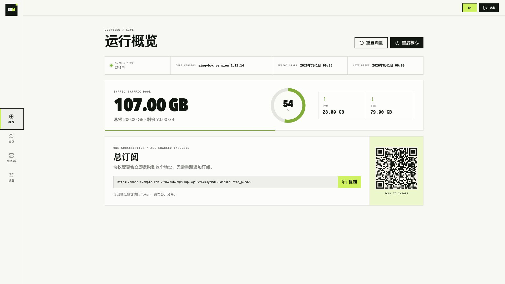
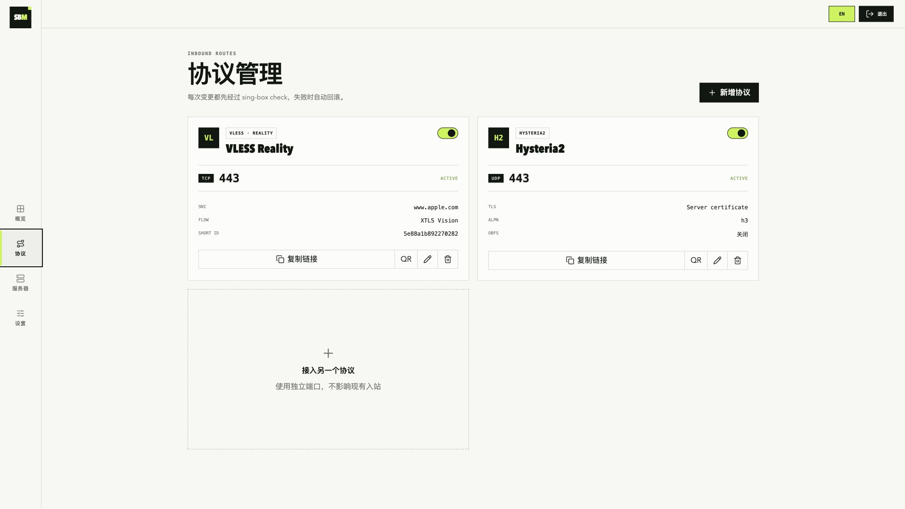

# SBM

[English](README.md) | 简体中文

SBM 是给单台 sing-box 服务器用的小面板，适合自用 VPS，不做多节点和多用户运营。

全新安装会启用两个入站：

- VLESS + Vision + REALITY：TCP/443
- Hysteria2：UDP/443

两者可以共用 443，因为一个走 TCP，另一个走 UDP。面板还会生成一个总订阅地址，包含所有已启用的入站。

## 安装

系统需要是 Debian 或 Ubuntu，架构支持 amd64 和 arm64。安装前先处理域名和安全组：

1. 添加域名 A 记录，指向 VPS 公网 IPv4。
2. 使用 Cloudflare 时，把代理状态设为 **DNS only / 灰云**。
3. 在云厂商安全组中放行以下端口：

| 端口 | 协议 | 用途 |
| --- | --- | --- |
| 80 | TCP | 申请和续期 Let's Encrypt 证书 |
| 443 | TCP | VLESS Reality |
| 443 | UDP | Hysteria2 |
| 2096 | TCP | Web 面板和总订阅 |

TCP/2096 只是默认值。安装时如果换了端口，安全组也要放行你实际填写的端口。

使用 root 运行：

```bash
sudo -i
bash <(curl -fsSL https://raw.githubusercontent.com/boltguo/sbm/main/install.sh)
```

安装脚本会询问：

```text
Domain: node.example.com
面板端口 [2096]:
节点名称 [🇯🇵Japan-Tokyo]:
```

端口直接回车就是 2096。节点名称会根据服务器公网 IP 生成，例如 `🇯🇵Japan-Tokyo`，不喜欢可以直接改。安装结束后，终端会打印面板地址、`admin` 用户名、随机密码和总订阅地址。

脚本先补齐缺少的软件包，再检查架构、磁盘、systemd、DNS、证书服务和端口。TCP/80、TCP/443、UDP/443 或面板端口已经被占用时，安装会停下来并说明原因。服务启动后，脚本还会检查监听端口，并从本机请求一次面板 HTTPS。

云安全组在 VPS 外面，安装脚本看不到，也不能代替你修改。VPS 内部的 UFW、firewalld 和严格的 iptables 规则会自动处理，已有的 iptables 规则不会被清空。OCI、AWS、GCP、Azure、阿里云和腾讯云等平台的控制台入口写在 [VPS 防火墙指南](docs/VPS-COMPATIBILITY.md) 里。

打开面板：

```text
https://node.example.com:2096/
```

忘记密码时运行 `sudo sbm`，选择 `重置管理员密码`。

## 界面截图

### 运行概览



### 协议管理



## 面板能做什么

- 中英文界面，可手动切换语言
- SBM 与 sing-box 版本、面板更新检测、流量、配额、重置周期和订阅二维码
- CPU、负载、内存、磁盘、运行时长、系统、内核和架构状态
- 新增、修改、启停和删除 VLESS Reality、Hysteria2 入站
- 复制单节点链接或显示二维码
- 自动生成 UUID、Reality 密钥、short ID 和 Hysteria2 密码
- 手动重置流量，或设置每月 1～28 日自动重置
- 协议变更前自动校验 sing-box，失败时恢复原配置

## 用 `sbm` 管理服务

```bash
sudo sbm
```

菜单包含：

1. 查看面板地址和运行状态
2. 重启面板
3. 重启 sing-box
4. 重置管理员密码
5. 查看日志
6. 更新面板
7. 更新 sing-box
8. 备份配置
9. 恢复配置
10. 卸载
11. 修复开机启动与防火墙

备份文件放在 `/root`。更新面板或 sing-box 时会校验 GitHub Release 的 SHA-256 摘要；新版本没有通过健康检查就恢复旧版本。

概览页的版本卡片会检查最新 GitHub Release，有新版本时显示红点。需要安装时通过 SSH 运行 `sudo sbm`，选择第 6 项即可。

登录成功、失败和被限流事件会写入 systemd journal，可通过以下命令查看：

```bash
journalctl -u sbm-panel -g 'audit event=login'
```

面板能直接管理宿主机服务，所以端口不要放得太宽。总订阅也使用这个端口；如果按来源 IP 限制，记得把需要更新订阅的手机和电脑也算进去。

## 添加其他入站

进入 `协议` 页面，选好协议和端口后应用配置。新端口还要在云安全组里放行对应的 TCP 或 UDP。

新增、修改、停用或删除入站不会改变总订阅地址。在 `设置` 中重新生成 Token 后，旧订阅地址会立即失效。

## 排查问题

查看面板状态和日志：

```bash
systemctl status sbm-panel --no-pager
journalctl -u sbm-panel -e --no-pager
```

检查 sing-box：

```bash
/usr/local/bin/sing-box check -c /etc/sing-box/config.json
systemctl status sing-box --no-pager
journalctl -u sing-box -e --no-pager
```

证书申请失败时，检查 A 记录、Cloudflare 灰云、TCP/80，以及 80 端口是否已被其他程序占用。

旧版安装器可能因为缺少 `cron` 卡在 acme.sh。重新运行现在的安装命令即可，脚本会先装好并启动 cron。`debconf: delaying package configuration, since apt-utils is not installed` 是 Debian 精简系统的普通提示，不代表安装失败。

## License

见 [LICENSE](LICENSE)。
