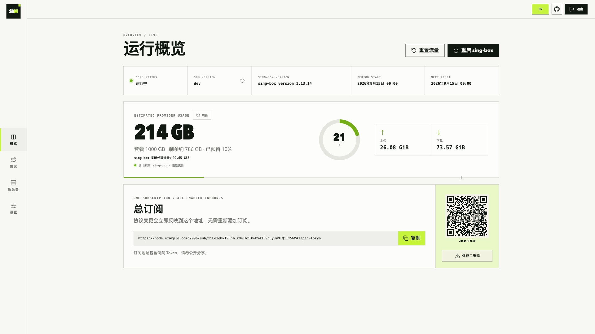
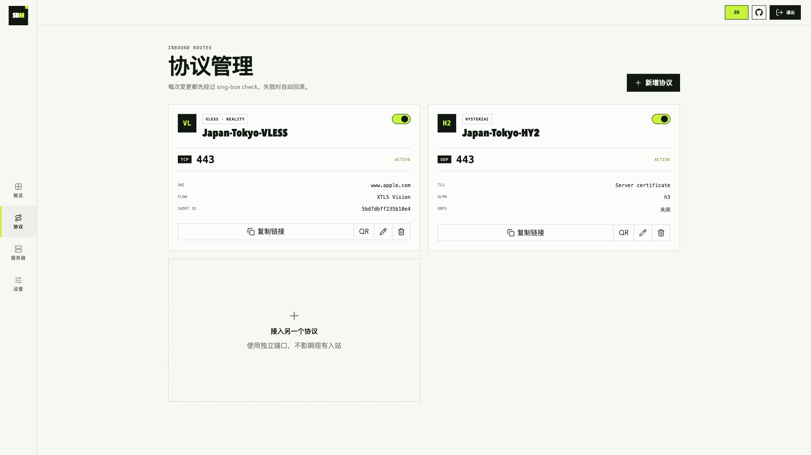

# SBM

[English](README.md) | 简体中文

SBM 是给单台 sing-box 服务器用的小面板，适合自用 VPS，不做多节点和多用户运营。

全新安装会启用两个入站：

- VLESS + Vision + REALITY：TCP/443
- Hysteria2：UDP/443

面板会生成一个总订阅地址，包含所有已启用的入站。

## 安装

SBM 2.x 使用全新的 v3 配置，只支持全新安装。它不会迁移或部分读取 1.x 配置；请先备份旧实例，再使用新配置部署 2.x。

系统需要是 Debian 或 Ubuntu，架构支持 amd64 和 arm64。安装前先处理域名和安全组：

1. 添加域名 A 记录，指向 VPS 公网 IPv4。
2. 使用 Cloudflare 时，把代理状态设为 **DNS only / 灰云**。
3. 在云厂商安全组中放行以下端口：

| 端口 | 协议 | 用途 |
| --- | --- | --- |
| 80 | TCP | 申请和续期 Let's Encrypt 证书 |
| 443 | TCP | VLESS Reality |
| 443 | UDP | Hysteria2 |
| 2096 | TCP | Web 面板和总订阅 |

TCP/2096 只是默认值。安装时如果换了端口，安全组也要放行你实际填写的端口。

分两步执行。先切换到 root：

```bash
sudo -i
```

已经在 root shell 里就跳过这一步。然后运行安装脚本：

```bash
bash <(curl -fsSL https://raw.githubusercontent.com/boltguo/sbm/main/install.sh)
```

安装器会同时锁定经过验证的 SBM 与 sing-box 版本组合，不会在上游发布新版后静默换成未经测试的 sing-box。需要安装指定的已发布 SBM 版本时，使用当前安装器并设置 `SBM_VERSION`：

```bash
SBM_VERSION=2.0.0 bash <(curl -fsSL https://raw.githubusercontent.com/boltguo/sbm/main/install.sh)
```

安装器会自动选择与该 SBM Release 对应的 sing-box 版本。排错或测试时仍可用 `SING_BOX_VERSION` 手动覆盖 core 版本，但未经验证的组合可能无法通过配置校验。2.x 只支持全新安装，不提供旧版配置迁移或旧版 SBM 安装映射。

安装脚本会询问：

```text
Domain: node.example.com
面板端口 [2096]:
节点名称 [JP-Tokyo]:
```

端口直接回车就是 2096。节点名称按服务器公网 IP 生成，格式为两位大写国家代码加城市，例如 `JP-Tokyo`、`SG-Singapore` 或 `US-Boardman`，随后生成带 `-VLESS` 和 `-HY2` 后缀的节点。安装结束后终端会打印面板地址、`admin` 用户名、随机密码和总订阅地址。

TCP/80、TCP/443、UDP/443 或面板端口被占用时安装会中止。服务起来后脚本会检查监听端口，并从本机请求一次面板 HTTPS。

VPS 内部的 UFW、firewalld 和 iptables 会自动处理，已有 iptables 规则不会被清空。云安全组在 VPS 外面，必须到厂商控制台手动配置。

打开面板：

```text
https://node.example.com:2096/
```

忘记密码时运行 `sudo sbm`，选择 `重置管理员密码`。

### 云防火墙与 VPS 兼容性

云厂商支持时，建议先绑定固定公网 IPv4，再把域名直接指向该地址。没有完整配置 IPv6 时应删除错误的 AAAA 记录。出站流量保持允许：证书签发、更新、DNS 和代理转发都会使用它。

安装表格中的四项是独立入站规则。特别是 `HTTPS/443` 预设通常只放行 TCP，Hysteria2 仍需单独放行 UDP/443。面板和总订阅共用面板端口；按来源 IP 限制时，所有需要更新订阅的手机和电脑都要包含在内。Clash API 只监听 `127.0.0.1:9090`，不要对公网开放。

| 平台 | 容易漏掉的设置 |
| --- | --- |
| Oracle Cloud (OCI) | 检查 VNIC 的 NSG 或子网 Security List，以及镜像自带防火墙；启用 ZPR 时还需允许策略。 |
| AWS EC2 | Security Group 要关联到实际 ENI；自定义 Network ACL 是无状态的，还要允许响应流量。用 Elastic IP 避免 Stop/Start 后地址变化。 |
| AWS Lightsail | IPv4 与 IPv6 防火墙互相独立；域名长期使用前先绑定 Static IP。 |
| Google Cloud | 允许规则要命中实例的 VPC、标签或服务账号，并排在拒绝策略之前；临时外部 IP 建议转为静态。 |
| Microsoft Azure | 子网与 NIC 的 NSG 都要允许，优先级数字越小越先执行；公网 IP 建议设为 Static。 |
| 阿里云 / 腾讯云 | 检查所有关联安全组、规则顺序和出站策略；预置 HTTPS 规则不会增加 UDP/443。 |
| DigitalOcean / Hetzner / Vultr / Linode | 创建规则后还要确认防火墙已启用，并确实关联到实例或标签。 |
| DMIT 和其他 KVM 商家 | 部分产品另有控制台防火墙，它与 UFW、firewalld、iptables 是两层过滤。 |

操作系统内执行 `reboot` 通常不会改变公网 IP；在云控制台 Stop/Start 或 Deallocate，EC2、Lightsail、GCP、Azure 的动态 IP 可能变化，DNS 仍指向旧地址。安装器会在全新安装时检查 DNS，但不会修改第三方 DNS。

## 界面截图

### 运行概览



### 协议管理



## 面板能做什么

- 中英文界面，可手动切换语言
- SBM 与 sing-box 版本、面板更新检测、云套餐流量估算、重置周期和订阅二维码
- 服务器健康页：CPU、负载、内存、磁盘、运行时长、服务/配置检查、TLS 到期、TCP/UDP 监听、采样状态和重置计划
- 新增、修改、启停和删除 VLESS Reality、Hysteria2 入站
- 复制单节点链接或显示二维码
- 自动生成 UUID、Reality 密钥、short ID 和 Hysteria2 密码
- 手动重置流量，或设置每月 1～28 日自动重置
- 可选自动、优先 IPv4、优先 IPv6、仅 IPv4 或仅 IPv6 的代理出口策略
- 协议变更前自动校验 sing-box，失败时恢复原配置

### 套餐流量与限额

在 `设置 → 套餐流量与周期` 中统一按十进制 GB 填写额度：厂商标 `1 TB` 就填 `1000 GB`，标 `500 GB` 就填 `500`。然后选择单向计费还是入站与出站双向合计，并设置安全预留。SBM 会计算 sing-box 代理流量的停机阈值，不需要用户自己把双向套餐除以 2。

概览页中的套餐额度与云厂商预计用量统一显示为 GB。最终账单仍以云厂商控制台为准：SBM 无法统计系统更新、SSH、面板访问、全部协议开销以及 VPS 上其他进程的流量。sing-box 实际字节计数使用 IEC 单位（`KiB`、`MiB`、`GiB`、`TiB`），便于明确区分数据来源。

SBM 规定 `1 GB = 10^9` 字节。双向套餐的代理停机阈值是扣除安全预留后额度的一半，因为上传、下载都会消耗套餐；单向套餐则使用扣除预留后的完整额度。`1000 GB / 双向 / 10%` 会得到 450,000,000,000 字节，也就是 450 GB、约 419.10 GiB 的代理阈值。

套餐额度填 `0` 表示不限量。有限额度达到安全阈值后，sing-box 会停止；手动或定时重置流量、或者提高套餐额度后会恢复。

### IPv4 / IPv6 出口

在 `设置 → 代理出口网络` 中可选择地址族策略。IPv6 地区归属更准确时建议使用“优先 IPv6”：目标有 AAAA 记录时优先走 IPv6，没有时仍回退 IPv4；“仅 IPv6”会让 IPv4-only 目标无法访问。

该策略要求 sing-box 1.12 或更高版本，并且只影响 sing-box 收到的域名目标。客户端已经把域名解析成 IP 时，服务端无法再切换地址族。客户端通过 IPv6 接入还需要域名有正确的 AAAA 记录，并在云防火墙和主机防火墙中放行对应端口。

### 服务器健康与诊断

服务器页只做只读检查。正常情况下只显示通过数量，需要关注时才展开警告、异常或未知项目，也可手动查看全部结果。检查范围包括 sing-box 服务与配置、流量采样、TLS 证书到期、面板与已启用入站的 TCP/UDP 监听、根分区阈值和下次流量重置。配额计划停机时不会把预期关闭的入站误报为故障；配置与证书检查会短暂缓存，监听状态则实时读取。

页面只返回结构化健康字段，不暴露密码、会话密钥、订阅 Token、UUID、私钥、完整配置或外部命令原始输出。域名与公网 IP 匹配不放进 Doctor，因为多记录、IPv6 和 NAT 都可能是合法配置，仅靠本机无法可靠判断。

## 用 `sbm` 管理服务

```bash
sudo sbm
```

菜单包含：

1. 查看面板地址和运行状态
2. 重启面板
3. 重启 sing-box
4. 重置管理员密码
5. 查看日志
6. 更新面板
7. 安装或恢复当前绑定版 sing-box
8. 备份配置
9. 恢复配置
10. 卸载
11. 修复开机启动与防火墙
12. 锁定或解锁 Web 管理入口，订阅保持可用

备份文件放在 `/root`。下载面板或 sing-box 时会校验 GitHub Release 的 SHA-256 摘要。面板更新会选择最新 SBM Release，第 7 项则安装当前 SBM 绑定的 sing-box 版本；替换后的二进制未通过配置校验或健康检查时会恢复替换前的二进制。

协议与出口修改采用事务式应用：先写候选配置、执行 `sing-box check` 并启动验证；校验或启动失败时，会恢复上一份业务配置和生成的核心配置。

概览页的版本卡片会检查最新 GitHub Release，有新版本时显示红点。需要安装时通过 SSH 运行 `sudo sbm`，选择第 6 项即可。

登录成功、失败和被限流事件会写入 systemd journal，可通过以下命令查看：

```bash
journalctl -u sbm-panel -g 'audit event=login'
```

面板能直接管理宿主机服务，端口不要放得太宽。总订阅共用这个端口，按来源 IP 限制时要把需要更新订阅的设备算进去。

平时很少改设置时，可以在 `sudo sbm` 中选择第 12 项锁定 Web 页面、登录和管理 API；已有 `/sub/...` 订阅地址继续可用。需要管理时再通过 SSH 选择同一项解锁。

## 添加其他入站

进入 `协议` 页面，选好协议和端口后应用配置。新端口还要在云安全组里放行对应的 TCP 或 UDP。

新增、修改、停用或删除入站不会改变总订阅地址。在 `设置` 中重新生成 Token 后，旧订阅地址会立即失效。

## 排查问题

查看面板状态和日志：

```bash
systemctl status sbm-panel --no-pager
journalctl -u sbm-panel -e --no-pager
```

检查 sing-box：

```bash
/usr/local/bin/sing-box check -c /etc/sing-box/config.json
systemctl status sing-box --no-pager
journalctl -u sing-box -e --no-pager
```

证书申请失败时，检查 A 记录、Cloudflare 灰云、TCP/80，以及 80 端口是否已被其他程序占用。

服务连不上时，先确认云规则确实关联到这台实例，再分别查看 TCP 和 UDP 监听：

```bash
sudo ss -lntp
sudo ss -lnup
```

运行 `sudo sbm` 选择第 11 项，可恢复主机防火墙规则和开机服务，但它不能修改云厂商防火墙。用另一条网络执行 `curl -vk https://你的域名:面板端口/` 测试；VPS 完全收不到数据包时，应先查 DNS、云防火墙、Network ACL 或上游网络，不要反复重装。

`debconf: delaying package configuration, since apt-utils is not installed` 是 Debian 精简系统的普通提示，不代表安装失败。

## License

见 [LICENSE](LICENSE)。
