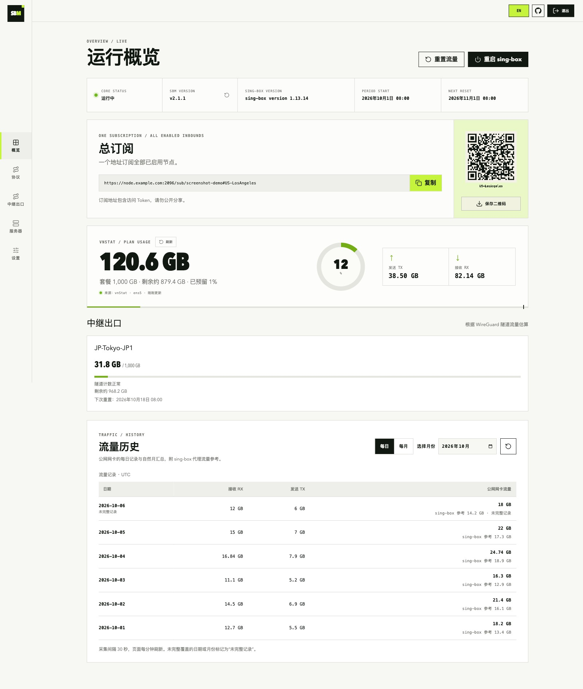
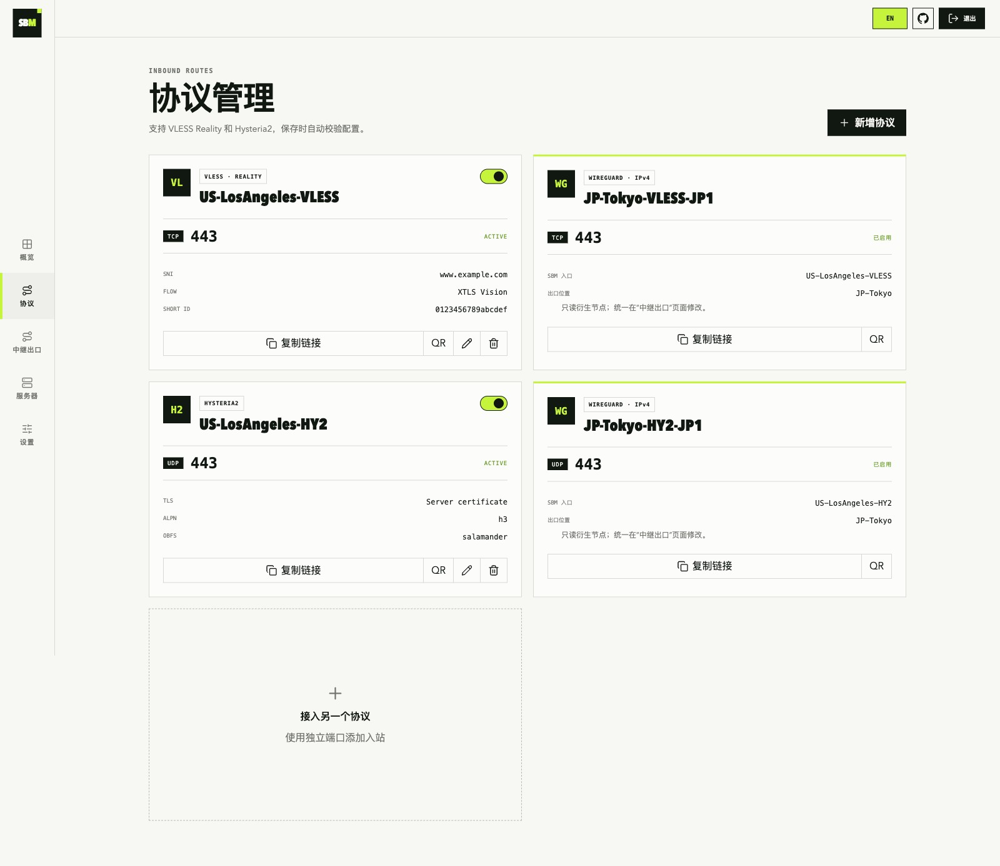

# SBM

[English](README.md) | 简体中文

SBM 是管理单台 sing-box 服务器的小面板，适合个人 VPS 使用。

全新安装会启用两个入站：

- VLESS + Vision + REALITY：TCP/443
- Hysteria2：UDP/443

面板会生成一个总订阅地址，包含所有已启用的入站。

## 多 WireGuard 中继出口

“中继出口”页面可管理多个可选 Gateway。客户端仍使用一个总订阅，通过同域名、同端口的独立 VLESS UUID / HY2 password 选择 Direct 或某个 Gateway。Direct 节点始终可用。

例如 `US-LosAngeles-VLESS` 从入口 A 出网，`US-Boardman-VLESS-AWS` 经 WireGuard 从 AWS B 出网；每个出口独立保存位置、标记、套餐、重置周期和流量基线。Gateway 套餐仅预警，本机全局套餐按入口公网网卡的 vnStat 用量执行停机。出口用量由 A 上的 WireGuard 隧道计数估算。

参见 [多 Gateway WireGuard 配置与排查](docs/WIREGUARD-EXIT.md)。Direct 和 Gateway 节点共用总订阅。节点名称冲突时加入端口与短标识，标记放在末尾；调整出口显示顺序可直接生效。

## 安装

面板支持网页自动更新与 CLI 更新，配置和流量历史会保留。

系统需要是 Debian 或 Ubuntu，架构支持 amd64 和 arm64。安装前先处理域名和安全组：

1. 添加域名 A 记录，指向 VPS 公网 IPv4。
2. 使用 Cloudflare 时，把代理状态设为 **DNS only / 灰云**。
3. 在云厂商安全组中放行以下端口：

| 端口 | 协议 | 用途 |
| --- | --- | --- |
| 80 | TCP | 申请和续期 Let's Encrypt 证书 |
| 443 | TCP | VLESS Reality |
| 443 | UDP | Hysteria2 |
| 2096 | TCP | Web 面板和总订阅 |

TCP/2096 只是默认值。安装时如果换了端口，安全组也要放行你实际填写的端口。

分两步执行。先切换到 root：

```bash
sudo -i
```

已经在 root shell 里就跳过这一步。然后运行安装脚本：

```bash
bash <(curl -fsSL https://raw.githubusercontent.com/boltguo/sbm/main/install.sh)
```

安装器使用经过验证的 SBM 与 sing-box 版本组合。安装指定的已发布 SBM 版本时，设置 `SBM_VERSION`：

```bash
SBM_VERSION=2.1.2 bash <(curl -fsSL https://raw.githubusercontent.com/boltguo/sbm/main/install.sh)
```

当前安装器支持 SBM 2.1 及以上的 2.x 发布，自动选择该 Release 对应的 sing-box 版本。排错或测试时可用 `SING_BOX_VERSION` 指定 core 版本。

安装脚本会询问：

```text
Domain: node.example.com
面板端口 [2096]:
节点名称 [JP-Tokyo]:
```

端口直接回车就是 2096。节点名称按服务器公网 IP 生成，格式为两位大写国家代码加城市，例如 `JP-Tokyo`、`SG-Singapore` 或 `US-Boardman`，随后生成带 `-VLESS` 和 `-HY2` 后缀的节点。安装结束后终端会打印面板地址、`admin` 用户名、随机密码和总订阅地址。

TCP/80、TCP/443、UDP/443 或面板端口被占用时安装会中止。服务起来后脚本会检查监听端口，并从本机请求一次面板 HTTPS。

VPS 内部的 UFW、firewalld 和 iptables 会自动处理，已有 iptables 规则不会被清空。云安全组在 VPS 外面，必须到厂商控制台手动配置。

打开面板：

```text
https://node.example.com:2096/
```

忘记密码时运行 `sudo sbm`，选择 `重置管理员密码`。

### 云防火墙与 VPS 兼容性

云厂商支持时，建议先绑定固定公网 IPv4，再把域名直接指向该地址。没有完整配置 IPv6 时应删除错误的 AAAA 记录。出站流量保持允许：证书签发、更新、DNS 和代理转发都会使用它。

安装表格中的四项是独立入站规则。特别是 `HTTPS/443` 预设通常只放行 TCP，Hysteria2 仍需单独放行 UDP/443。面板和总订阅共用面板端口；按来源 IP 限制时，所有需要更新订阅的手机和电脑都要包含在内。Clash API 只监听 `127.0.0.1:9090`，不要对公网开放。

| 平台 | 容易漏掉的设置 |
| --- | --- |
| Oracle Cloud (OCI) | 检查 VNIC 的 NSG 或子网 Security List，以及镜像自带防火墙；启用 ZPR 时还需允许策略。 |
| AWS EC2 | Security Group 要关联到实际 ENI；自定义 Network ACL 是无状态的，还要允许响应流量。用 Elastic IP 避免 Stop/Start 后地址变化。 |
| AWS Lightsail | IPv4 与 IPv6 防火墙互相独立；域名长期使用前先绑定 Static IP。 |
| Google Cloud | 允许规则要命中实例的 VPC、标签或服务账号，并排在拒绝策略之前；临时外部 IP 建议转为静态。 |
| Microsoft Azure | 子网与 NIC 的 NSG 都要允许，优先级数字越小越先执行；公网 IP 建议设为 Static。 |
| 阿里云 / 腾讯云 | 检查所有关联安全组、规则顺序和出站策略；预置 HTTPS 规则不会增加 UDP/443。 |
| DigitalOcean / Hetzner / Vultr / Linode | 创建规则后还要确认防火墙已启用，并确实关联到实例或标签。 |
| DMIT 和其他 KVM 商家 | 部分产品另有控制台防火墙，它与 UFW、firewalld、iptables 是两层过滤。 |

操作系统内执行 `reboot` 通常不会改变公网 IP；在云控制台 Stop/Start 或 Deallocate，EC2、Lightsail、GCP、Azure 的动态 IP 可能变化，DNS 仍指向旧地址。安装器会在全新安装时检查 DNS，但不会修改第三方 DNS。

## 界面截图

以下截图使用示例数据。

### 运行概览



### 协议管理



## 面板能做什么

- 中英文界面，可手动切换语言
- SBM 与 sing-box 版本、面板自动更新、vnStat 公网网卡套餐用量、重置周期和订阅二维码
- 服务器健康页：CPU、负载、内存、磁盘、运行时长、服务/配置检查、TLS 到期、TCP/UDP 监听、采样状态和重置计划
- 新增、修改、启停和删除 VLESS Reality、Hysteria2 入站
- 复制单节点链接或显示二维码
- 自动生成 UUID、Reality 密钥、short ID 和 Hysteria2 密码
- 手动重置流量，或设置每月 1～28 日自动重置
- 可选自动、优先 IPv4、优先 IPv6、仅 IPv4 或仅 IPv6 的代理出口策略
- 协议变更前自动校验 sing-box，失败时恢复原配置

### 套餐流量与限额

`设置 → 套餐流量与周期` 按云厂商标注选择 GB 或 GiB：GB 按 1000³ 字节，GiB 按 1024³ 字节。DMIT `1000 GB` 填 `1000 GB`；GCP `200 GiB` 填 `200 GiB`。

流量统计使用选定公网网卡的 **vnStat 2.10 或更新版本** 数据：单向套餐按 TX 计费，双向套餐按 RX + TX 计费。该网卡上的代理、WireGuard、SSH 和系统更新等通信都计入统计，云厂商账单以其后台为准。

已有符合要求的 vnStat 会直接复用；未安装时由安装器安装系统包。安装器会检查版本与网卡数据、启用服务，并设置 UTC 记录和每分钟保存。源记录至少保留 90 天每日数据、40 天每小时数据及 48 小时五分钟数据；已有更长或无限保留设置及源数据库会保留。在“设置 → vnStat 公网网卡”中指定接口，留空使用 Linux 默认路由网卡。

套餐额度填 `0` 表示不限量。安全停机阈值为套餐额度减去预留量；达到阈值后 sing-box 停止，重置流量或提高额度后恢复。数据采集和保存存在延迟，请按实际传输速度设置预留量。

### 每日与每月流量历史

运行概览中的“流量历史”展示公网网卡每日 RX、TX 和总流量，并按自然月汇总。sing-box 代理流量以小字显示，作为参考对照。统计从启用时开始，未完整覆盖的日期或月份标注为“未完整记录”。

入口每 30 秒采集 vnStat 数据，历史保存在 `/var/lib/sbm/traffic.db`。采集恢复后可补读 vnStat 保留的记录；已保存的历史在面板重启和套餐重置后保留。没有网卡记录的日期显示“未记录 vnStat”，没有代理参考时显示“—”。

入口和各 Gateway 分别使用独立的套餐周期。例如入口每月 15 日重置、出口每月 1 日重置，各自只重置本周期用量。历史按自然月汇总，与套餐账期独立。手动重置使用最新 vnStat 数据，需要数据源可用；vnStat 数据库与流量历史会保留。

Gateway 卡片显示当前周期的 WireGuard 隧道估算，后台保存每日 TX/RX。出口套餐达到阈值时提示预警，继续运行；入口全局限额按本机公网网卡流量执行停机。入口总流量包含所有 Direct、Gateway 和系统通信，每个出口有独立的隧道统计。

历史接口需要管理员登录：`GET /api/traffic/history`，参数为 `granularity=day|month`、`from` 和 `to`。日期使用 `YYYY-MM-DD` 或 `YYYY-MM`，结束日期包含在内。接口返回网卡用量、代理参考及记录完整性。

`sudo sbm` 的备份功能会短暂暂停面板以保存一致的数据库文件，sing-box 继续转发。手动备份可停止面板或使用 SQLite 在线备份功能。

### IPv4 / IPv6 出口

在 `设置 → 代理出口网络` 中选择自动、优先 IPv4、优先 IPv6、仅 IPv4 或仅 IPv6。“优先”允许回退到另一地址族；“仅”限定使用所选地址族。

策略适用于 sing-box 收到的域名目标；客户端已解析为 IP 的目标使用该 IP 的地址族。客户端通过 IPv6 接入需要正确的 AAAA 记录，以及云防火墙和主机防火墙对应的端口规则。

### 服务器健康与诊断

服务器页每 5 秒刷新主机资源和全部诊断结果，包括 sing-box 服务与配置、流量采样、TLS 证书到期、面板与入站的 TCP/UDP 监听、磁盘空间和流量重置计划。重置时间按套餐时区显示，vnStat 在 sing-box 停止时也持续采集整机流量。

## 用 `sbm` 管理服务

```bash
sudo sbm
```

菜单包含：

1. 查看面板地址和运行状态
2. 重启面板
3. 重启 sing-box
4. 重置管理员密码
5. 查看日志
6. 更新面板
7. 安装或恢复当前绑定版 sing-box
8. 备份配置
9. 恢复配置
10. 卸载
11. 修复开机启动与防火墙
12. 锁定或解锁 Web 管理入口，订阅保持可用

备份文件放在 `/root`。下载面板或 sing-box 时会校验 GitHub Release 的 SHA-256 摘要。面板更新会选择最新 SBM Release，第 7 项则安装当前 SBM 绑定的 sing-box 版本；替换后的二进制未通过配置校验或健康检查时会恢复替换前的二进制。

协议与出口配置保存时自动校验，应用失败时恢复原配置。

恢复备份会重新应用端口规则并移除项目记录的旧端口。检测到管理端口已有的来源限制或自定义规则时会保留；可在 `/etc/sbm/firewall-preserved` 中按 `tcp 2096` 格式列出由自己管理的端口。

概览页的版本卡片显示可用更新。选择“立即更新”后，面板在后台下载、校验和安装，重启服务并验证可用性，完成后页面自动刷新。配置、流量历史和 vnStat 数据会保留，sing-box 继续运行；更新失败时恢复上一版面板和管理脚本。

更新过程中可关闭页面，重新打开概览页查看进度。网页与 CLI 更新互斥。失败详情查看 `journalctl -u sbm-panel-update`。网页更新适用于标准系统安装；开发模式和自定义路径实例通过各自部署方式更新。

登录成功、失败和被限流事件会写入 systemd journal，可通过以下命令查看：

```bash
journalctl -u sbm-panel -g 'audit event=login'
```

面板能直接管理宿主机服务，端口不要放得太宽。总订阅共用这个端口，按来源 IP 限制时要把需要更新订阅的设备算进去。

平时很少改设置时，可以在 `sudo sbm` 中选择第 12 项锁定 Web 页面、登录和管理 API；已有 `/sub/...` 订阅地址继续可用。需要管理时再通过 SSH 选择同一项解锁。

## 添加其他入站

进入 `协议` 页面，选好协议和端口后应用配置。新端口还要在云安全组里放行对应的 TCP 或 UDP。

新增、修改、停用或删除入站不会改变总订阅地址。在 `设置` 中重新生成 Token 后，旧订阅地址会立即失效。

## 排查问题

查看面板状态和日志：

```bash
systemctl status sbm-panel --no-pager
journalctl -u sbm-panel -e --no-pager
```

检查 sing-box：

```bash
/usr/local/bin/sing-box check -c /etc/sing-box/config.json
systemctl status sing-box --no-pager
journalctl -u sing-box -e --no-pager
```

证书申请失败时，检查 A 记录、Cloudflare 灰云、TCP/80，以及 80 端口是否已被其他程序占用。

服务连不上时，先确认云规则确实关联到这台实例，再分别查看 TCP 和 UDP 监听：

```bash
sudo ss -lntp
sudo ss -lnup
```

运行 `sudo sbm` 选择第 11 项，可恢复主机防火墙规则和开机服务，但它不能修改云厂商防火墙。用另一条网络执行 `curl -vk https://你的域名:面板端口/` 测试；VPS 完全收不到数据包时，应先查 DNS、云防火墙、Network ACL 或上游网络，不要反复重装。

`debconf: delaying package configuration, since apt-utils is not installed` 是 Debian 精简系统的普通提示，不代表安装失败。

## License

见 [LICENSE](LICENSE)。
