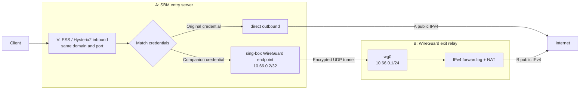
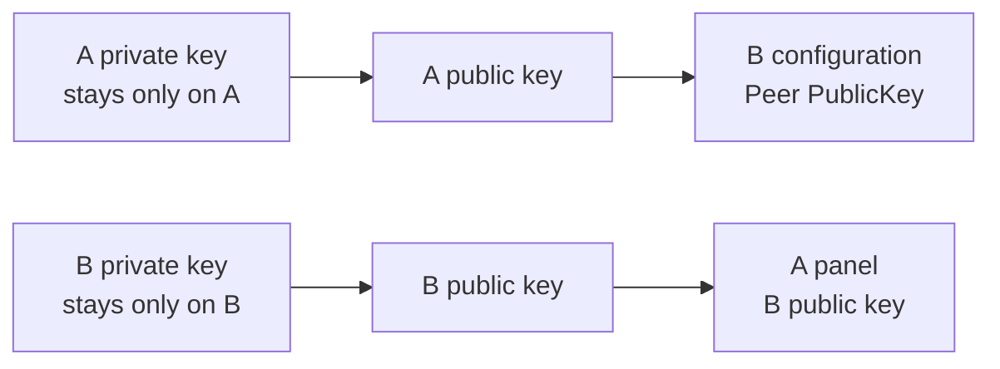

# WireGuard B relay (IPv4 exit)

[简体中文](WIREGUARD-EXIT.md) | English

SBM can serve direct nodes and companion nodes that leave through a B relay from the same entry server.

In this guide:

- **A** is the entry server running SBM. It accepts VLESS and Hysteria2 connections from clients.
- **B** is the WireGuard IPv4 exit relay. It can be a GCP or AWS instance or a regular VPS.
- A **direct node** goes from A to the internet.
- A **companion node** follows `client → A → WireGuard → B → internet`.

Enabling companion nodes adds a separate credential on the same domain and port for every enabled protocol. The original direct nodes remain available, so the client selects the exit simply by switching nodes.

## How it works



SBM does not open another VLESS or Hysteria2 port for companion nodes. It adds another credential to the existing inbound instead. sing-box routes by authenticated user: the original credential uses A's `direct` outbound, while the companion credential enters the WireGuard endpoint. B decapsulates, forwards, and NATs the traffic, so destination sites see B's public IPv4.

Domain targets received through companion credentials are resolved as IPv4. Original nodes are unaffected and continue to use the panel's `Proxy egress network` setting.

## Requirements

B must meet these requirements:

1. It can run WireGuard and forward and NAT IPv4 traffic.
2. A can reach B's public IPv4 address and WireGuard UDP port.
3. B's cloud firewall and host firewall permit that UDP traffic.
4. B can reach the internet, and its provider permits this use.

Use a fixed public IPv4 address for B whenever possible. SBM currently accepts an IPv4 address, not a hostname. If B's address changes, update it manually in the panel.

GCP, AWS Lightsail, AWS EC2, and regular VPS providers use the same design. Their main differences are where fixed addresses, firewall rules, and forwarding are configured:

| Platform | Check |
| --- | --- |
| GCP | Use a static external IPv4; enable IP forwarding on the instance; allow UDP/51820 from A in the VPC firewall |
| AWS Lightsail | Attach a Static IP; allow UDP/51820 from A in the IPv4 Firewall |
| AWS EC2 | Attach an Elastic IP; allow UDP/51820 from A in the instance's Security Group |
| Regular VPS | Confirm that the public IPv4 is fixed; allow UDP/51820 from A in both provider and host firewalls |

`51820` is the example port in this guide. Any unused UDP port can be used, but B's configuration, the external firewall, and A's panel must all use the same value.

A residential public IPv4 can also act as B using exactly the same principle, but its UDP port must be forwardable to B; CGNAT cannot be used directly. This guide focuses on a standard Debian or Ubuntu B relay.

## 1. Generate A's keys in the panel

Open `Settings → WireGuard companion nodes`:

1. Leave the switch off for now.
2. Select `Generate A keys`.
3. Copy `A public key` for use on B.
4. Select `Save WireGuard settings` to store A's private key.

Do not copy A's private key to B, and never disclose either side's private key.

The key mapping is:



## 2. Prepare B's network

Assign a fixed public IPv4 to B and add this inbound rule to the provider firewall:

| Field | Value |
| --- | --- |
| Protocol | UDP |
| Destination port | `51820` |
| Source | `A_PUBLIC_IPV4/32` |

Replace `A_PUBLIC_IPV4` with A's actual public IPv4. There is no need to expose the WireGuard port to `0.0.0.0/0`.

On GCP, enable IP forwarding in the instance network settings.

## 3. Install WireGuard on B

Connect to B over SSH:

```bash
sudo apt update
sudo apt install -y wireguard iptables iproute2
```

Install nano if you want to use it as the editor:

```bash
sudo apt install -y nano
```

Generate B's keys:

```bash
sudo install -d -m 700 /etc/wireguard
sudo sh -c '
umask 077
wg genkey > /etc/wireguard/b-private.key
wg pubkey < /etc/wireguard/b-private.key > /etc/wireguard/b-public.key
'
```

Display B's public key:

```bash
sudo cat /etc/wireguard/b-public.key
```

Save this public key for A's panel. Do not copy or disclose `/etc/wireguard/b-private.key`.

## 4. Find B's public interface

Run:

```bash
ip route show default
```

Example output:

```text
default via 172.26.0.1 dev ens5 proto dhcp
```

The value after `dev`, `ens5` in this example, is the public egress interface. Providers may use `ens4`, `ens5`, `eth0`, or another name. The configuration below must use the actual value.

If the command reports `ip: command not found`, install it first:

```bash
sudo apt update
sudo apt install -y iproute2
```

## 5. Enable IPv4 forwarding on B

```bash
echo 'net.ipv4.ip_forward=1' | sudo tee /etc/sysctl.d/70-wireguard-routing.conf
sudo sysctl -p /etc/sysctl.d/70-wireguard-routing.conf
```

Verify it:

```bash
sysctl net.ipv4.ip_forward
```

The result should be:

```text
net.ipv4.ip_forward = 1
```

## 6. Create B's WireGuard configuration

Open the configuration file:

```bash
sudo nano /etc/wireguard/wg0.conf
```

Enter:

```ini
[Interface]
Address = 10.66.0.1/24
ListenPort = 51820
MTU = 1408
PostUp = wg set %i private-key /etc/wireguard/b-private.key
PostUp = iptables -A FORWARD -i %i -o B_PUBLIC_INTERFACE -j ACCEPT
PostUp = iptables -A FORWARD -i B_PUBLIC_INTERFACE -o %i -m conntrack --ctstate RELATED,ESTABLISHED -j ACCEPT
PostUp = iptables -t nat -A POSTROUTING -s 10.66.0.0/24 -o B_PUBLIC_INTERFACE -j MASQUERADE
PostDown = iptables -D FORWARD -i %i -o B_PUBLIC_INTERFACE -j ACCEPT
PostDown = iptables -D FORWARD -i B_PUBLIC_INTERFACE -o %i -m conntrack --ctstate RELATED,ESTABLISHED -j ACCEPT
PostDown = iptables -t nat -D POSTROUTING -s 10.66.0.0/24 -o B_PUBLIC_INTERFACE -j MASQUERADE

[Peer]
PublicKey = A_PUBLIC_KEY
AllowedIPs = 10.66.0.2/32
```

Replace both placeholders:

- `B_PUBLIC_INTERFACE` with B's public interface from step 4, such as `ens5`.
- `A_PUBLIC_KEY` with the public key copied from A's panel in step 1.

In nano, press `Ctrl+O`, Enter to save, then `Ctrl+X` to exit.

Set permissions and start WireGuard:

```bash
sudo chmod 600 /etc/wireguard/wg0.conf /etc/wireguard/b-private.key
sudo systemctl enable --now wg-quick@wg0
sudo wg show
```

It is normal not to see `latest handshake` yet because companion nodes are not enabled on A.

If B uses UFW, replace `B_PUBLIC_INTERFACE` with the actual interface and run:

```bash
sudo ufw allow from A_PUBLIC_IPV4 to any port 51820 proto udp
sudo ufw route allow in on wg0 out on B_PUBLIC_INTERFACE
```

## 7. Enable companion nodes on A

Open `Settings → WireGuard companion nodes` and fill in:

| Field | Value |
| --- | --- |
| Subscription name suffix | A label such as `AWS`, `GCP`, or `VPS` |
| B public IPv4 | B's fixed public IPv4 |
| B UDP port | `51820`, or the port configured on B |
| A private key | A's private key generated in step 1 |
| B public key | The contents of `/etc/wireguard/b-public.key` |

Turn on the switch and save. A does not need a system WireGuard package; SBM uses sing-box's built-in userspace WireGuard endpoint.

The subscription suffix controls only the displayed node name. A suffix of `AWS`, for example, produces:

```text
Original VLESS node
Original Hysteria2 node
VLESS · via AWS
Hysteria2 · via AWS
```

Saving a new suffix or B configuration updates the existing companion nodes to use that name and exit. Only one B can be configured at a time.

## 8. Verify the tunnel

Run on B:

```bash
sudo wg show
```

A working connection shows:

```text
latest handshake: ...
transfer: ... received, ... sent
```

Refresh the client subscription, select a `via ...` node, and open:

```text
https://cloudflare.com/cdn-cgi/trace
```

The `ip=` value should be B's public IPv4. Switching back to an original node should restore A as the exit.

Turning off companion nodes in the panel hides their credentials from sing-box and the subscription without deleting their UUIDs or passwords. Turning them on again keeps the client credentials unchanged.

## Troubleshooting

### The WireGuard service does not start

```bash
sudo systemctl status wg-quick@wg0 --no-pager
sudo journalctl -u wg-quick@wg0 -e --no-pager
sudo ss -lunp | grep 51820
```

Check that:

- `B_PUBLIC_INTERFACE` was replaced with the real interface.
- A's public key is complete and was not confused with A's private key.
- No other process is using UDP/51820.

### No handshake

```bash
sudo wg show
sudo ss -lunp | grep 51820
```

Then confirm:

- A's panel contains B's current public IPv4 and B's public key.
- The cloud firewall allows UDP/51820 from A.
- B's host firewall allows UDP/51820.

### A handshake exists, but the internet is unreachable

```bash
sysctl net.ipv4.ip_forward
sudo iptables -t nat -S POSTROUTING
ip route show default
```

All of these must be true:

- `net.ipv4.ip_forward = 1`
- A `MASQUERADE` rule exists for `10.66.0.0/24`
- The NAT and FORWARD rules use B's correct public interface

If UFW is enabled, also confirm a route allow rule from `wg0` to the public interface.

### It worked and then stopped

Check whether B's public IPv4 changed. A dynamic cloud address can change after the instance is stopped, released, or recreated. Update B's IPv4 in the panel and save again.

### The panel briefly disconnects while saving

Saving WireGuard settings updates the sing-box configuration and restarts the core. If the browser itself is using A's proxy, its connection can drop briefly. SBM 1.2.1 and later retain settings that were applied successfully; wait a moment and refresh.

## Resources, transfer, and security

- A 512 MB Linux instance is generally sufficient when B only runs WireGuard. A 512 MB to 1 GB swap file can help on a small instance.
- Both A's and B's plans may count the traffic, and providers can count inbound and outbound transfer separately or together. Base usable proxy traffic on the smaller allowance and leave room for tunnel overhead.
- Latency between A and B is added to the connection. Keeping B reasonably close to A usually gives a more stable result.
- B is the final IPv4 exit, so destination sites see B's address. Providers may restrict proxy or high-volume use; follow their terms.
- Expose the WireGuard UDP port only to A's public IPv4, protect both private keys, and keep B's system security updates installed.
