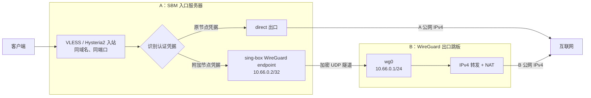
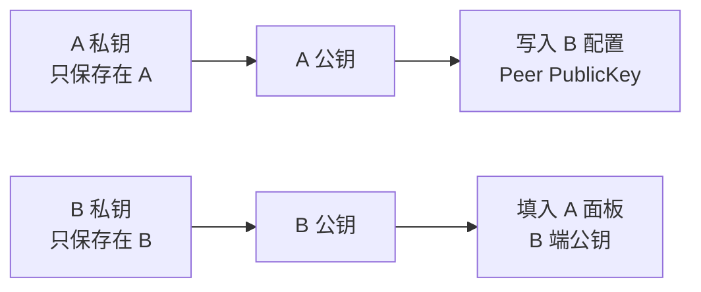

# WireGuard B 端跳板（IPv4 出口）

[English](WIREGUARD-EXIT.en.md) | 简体中文

SBM 可以让同一台入口服务器同时提供直连节点和经 B 跳板出口的附加节点。

本文中：

- **A**：已安装 SBM 的入口服务器，接收客户端的 VLESS 或 Hysteria2 连接。
- **B**：运行 WireGuard 的 IPv4 出口跳板，可以是 GCP、AWS 或普通 VPS。
- **直连节点**：流量直接从 A 访问互联网。
- **附加节点**：流量按 `客户端 → A → WireGuard → B → 互联网` 转发。

打开附加节点开关后，订阅会为每个已启用协议增加一组同域名、同端口的独立凭据。原直连节点始终保留，客户端通过切换节点选择出口。

## 工作原理



SBM 不会为附加节点再开放一组 VLESS 或 Hysteria2 端口，而是在原入站中增加一组认证凭据。sing-box 根据认证用户分流：原凭据走 A 的 `direct` 出口，附加凭据进入 WireGuard endpoint；B 解封装后执行 IPv4 转发和 NAT，所以目标网站看到的是 B 的公网 IPv4。

附加节点收到的域名目标固定按 IPv4 解析。原节点不受影响，继续使用面板中 `代理出口网络` 的设置。

## 适用条件

B 需要满足以下条件：

1. 能运行 WireGuard，并允许转发和 NAT IPv4 流量。
2. A 能访问 B 的公网 IPv4 和 WireGuard UDP 端口。
3. B 的云防火墙和系统防火墙允许该 UDP 流量。
4. B 允许访问互联网，并且套餐或服务商允许这种用途。

建议给 B 使用固定公网 IPv4。SBM 当前只接受 IPv4 地址，不接受域名；B 的地址变化后需要在面板中手动更新。

GCP、AWS Lightsail、AWS EC2 和普通 VPS 的原理相同。差别主要在固定 IP、防火墙和转发开关的位置：

| 平台 | 需要确认 |
| --- | --- |
| GCP | 使用静态外部 IPv4；实例启用 IP 转发；VPC 防火墙允许来自 A 的 UDP/51820 |
| AWS Lightsail | 绑定 Static IP；IPv4 Firewall 允许来自 A 的 UDP/51820 |
| AWS EC2 | 绑定 Elastic IP；实例关联的 Security Group 允许来自 A 的 UDP/51820 |
| 普通 VPS | 确认公网 IPv4 固定；商家防火墙和系统防火墙允许来自 A 的 UDP/51820 |

`51820` 是本文使用的默认端口，可以换成其他未占用的 UDP 端口，但 B 配置、云防火墙和 A 面板必须保持一致。

住宅公网 IPv4 也能作为 B，原理完全相同，但必须能把 UDP 端口转发到 B；CGNAT 不能直接使用。本文只介绍 Debian/Ubuntu B 跳板的标准配置。

## 1. 在 A 面板生成密钥

进入 `设置 → WireGuard 附加节点`：

1. 开关暂时保持关闭。
2. 点击“生成 A 端密钥”。
3. 复制“A 端公钥”，稍后填入 B。
4. 点击“保存 WireGuard 设置”，保存 A 的私钥。

不要把 A 的私钥复制到 B，也不要公开任何一端的私钥。

两端密钥的对应关系如下：



## 2. 准备 B 的网络

给 B 分配固定公网 IPv4，并在平台防火墙中添加一条入站规则：

| 项目 | 设置 |
| --- | --- |
| 协议 | UDP |
| 目标端口 | `51820` |
| 来源 | `A_PUBLIC_IPV4/32` |

将 `A_PUBLIC_IPV4` 替换为 A 的实际公网 IPv4。没有必要向 `0.0.0.0/0` 开放 WireGuard 端口。

GCP 实例还应在网络设置中启用 IP 转发。

## 3. 在 B 安装 WireGuard

通过 SSH 登录 B：

```bash
sudo apt update
sudo apt install -y wireguard iptables iproute2
```

如果需要使用 nano 编辑器：

```bash
sudo apt install -y nano
```

生成 B 的密钥：

```bash
sudo install -d -m 700 /etc/wireguard
sudo sh -c '
umask 077
wg genkey > /etc/wireguard/b-private.key
wg pubkey < /etc/wireguard/b-private.key > /etc/wireguard/b-public.key
'
```

显示 B 公钥：

```bash
sudo cat /etc/wireguard/b-public.key
```

保存这个公钥，稍后填入 A 面板。不要复制或公开 `/etc/wireguard/b-private.key`。

## 4. 确认 B 的公网网卡

执行：

```bash
ip route show default
```

输出类似：

```text
default via 172.26.0.1 dev ens5 proto dhcp
```

`dev` 后面的 `ens5` 就是公网出口网卡。不同平台可能显示 `ens4`、`ens5`、`eth0` 或其他名称，后续配置必须使用实际值。

如果提示 `ip: command not found`，先执行：

```bash
sudo apt update
sudo apt install -y iproute2
```

## 5. 开启 B 的 IPv4 转发

```bash
echo 'net.ipv4.ip_forward=1' | sudo tee /etc/sysctl.d/70-wireguard-routing.conf
sudo sysctl -p /etc/sysctl.d/70-wireguard-routing.conf
```

确认：

```bash
sysctl net.ipv4.ip_forward
```

应输出：

```text
net.ipv4.ip_forward = 1
```

## 6. 创建 B 的 WireGuard 配置

打开配置文件：

```bash
sudo nano /etc/wireguard/wg0.conf
```

写入：

```ini
[Interface]
Address = 10.66.0.1/24
ListenPort = 51820
MTU = 1408
PostUp = wg set %i private-key /etc/wireguard/b-private.key
PostUp = iptables -A FORWARD -i %i -o B_PUBLIC_INTERFACE -j ACCEPT
PostUp = iptables -A FORWARD -i B_PUBLIC_INTERFACE -o %i -m conntrack --ctstate RELATED,ESTABLISHED -j ACCEPT
PostUp = iptables -t nat -A POSTROUTING -s 10.66.0.0/24 -o B_PUBLIC_INTERFACE -j MASQUERADE
PostDown = iptables -D FORWARD -i %i -o B_PUBLIC_INTERFACE -j ACCEPT
PostDown = iptables -D FORWARD -i B_PUBLIC_INTERFACE -o %i -m conntrack --ctstate RELATED,ESTABLISHED -j ACCEPT
PostDown = iptables -t nat -D POSTROUTING -s 10.66.0.0/24 -o B_PUBLIC_INTERFACE -j MASQUERADE

[Peer]
PublicKey = A_PUBLIC_KEY
AllowedIPs = 10.66.0.2/32
```

替换两个占位符：

- `B_PUBLIC_INTERFACE`：第 4 步查到的 B 公网网卡，例如 `ens5`。
- `A_PUBLIC_KEY`：第 1 步从 A 面板复制的公钥。

在 nano 中按 `Ctrl+O`、回车保存，再按 `Ctrl+X` 退出。

设置权限并启动：

```bash
sudo chmod 600 /etc/wireguard/wg0.conf /etc/wireguard/b-private.key
sudo systemctl enable --now wg-quick@wg0
sudo wg show
```

此时还没有 `latest handshake` 是正常的，因为 A 尚未启用附加节点。

如果 B 启用了 UFW，将 `B_PUBLIC_INTERFACE` 换成实际网卡后执行：

```bash
sudo ufw allow from A_PUBLIC_IPV4 to any port 51820 proto udp
sudo ufw route allow in on wg0 out on B_PUBLIC_INTERFACE
```

## 7. 在 A 面板启用附加节点

进入 `设置 → WireGuard 附加节点`，填写：

| 字段 | 内容 |
| --- | --- |
| 订阅名称后缀 | 自定义标识，例如 `AWS`、`GCP`、`VPS` |
| B 机公网 IPv4 | B 的固定公网 IPv4 |
| B 机 UDP 端口 | `51820`，或你实际配置的端口 |
| A 端私钥 | 第 1 步生成的 A 私钥 |
| B 端公钥 | `/etc/wireguard/b-public.key` 的内容 |

打开开关并保存。A 不需要安装系统 WireGuard；SBM 会使用 sing-box 内置的用户态 WireGuard endpoint。

“订阅名称后缀”只控制节点显示名称。例如填写 `AWS` 后，订阅中会出现：

```text
原 VLESS 节点
原 Hysteria2 节点
VLESS · via AWS
Hysteria2 · via AWS
```

修改后缀或 B 配置并保存后，现有附加节点会更新为新的名称和出口。当前只支持同时配置一个 B。

## 8. 验证

在 B 执行：

```bash
sudo wg show
```

连接成功后应看到：

```text
latest handshake: ...
transfer: ... received, ... sent
```

客户端刷新订阅并选择 `via ...` 节点，然后访问：

```text
https://cloudflare.com/cdn-cgi/trace
```

其中的 `ip=` 应是 B 的公网 IPv4。切回原节点后，出口应恢复为 A。

关闭面板中的附加节点开关，会从 sing-box 和订阅中隐藏附加凭据，但不会删除其 UUID 或密码；重新打开后客户端节点凭据保持不变。

## 排查问题

### WireGuard 服务无法启动

```bash
sudo systemctl status wg-quick@wg0 --no-pager
sudo journalctl -u wg-quick@wg0 -e --no-pager
sudo ss -lunp | grep 51820
```

重点检查：

- `B_PUBLIC_INTERFACE` 是否已替换为真实网卡。
- A 公钥是否完整，且没有误填 A 私钥。
- UDP/51820 是否已被其他程序占用。

### 没有握手

```bash
sudo wg show
sudo ss -lunp | grep 51820
```

然后确认：

- A 面板填写的是 B 当前的公网 IPv4 和 B 公钥。
- 云防火墙允许来自 A 的 UDP/51820。
- B 的系统防火墙允许 UDP/51820。

### 有握手但无法访问互联网

```bash
sysctl net.ipv4.ip_forward
sudo iptables -t nat -S POSTROUTING
ip route show default
```

必须满足：

- `net.ipv4.ip_forward = 1`
- 存在针对 `10.66.0.0/24` 的 `MASQUERADE` 规则
- NAT 与 FORWARD 规则使用正确的 B 公网网卡

如果使用 UFW，还要确认存在从 `wg0` 到公网网卡的 route allow 规则。

### 能使用一段时间，之后突然失效

先核对 B 的公网 IPv4 是否变化。动态云 IP 可能在关机、释放或重新创建实例后改变；更新面板中的 B IPv4 后重新保存。

### 保存时面板短暂断开

保存 WireGuard 设置会更新 sing-box 配置并重启核心。如果浏览器本身正在经过 A 的代理，连接可能短暂中断；SBM 1.2.1 及以后会保留已经成功应用的设置，等待片刻后刷新即可。

## 资源、流量与安全

- 只做 WireGuard 出口时，512 MB 内存的 Linux B 通常足够；小内存实例可以配置 512 MB～1 GB swap。
- A 与 B 的套餐都会计算流量，部分服务商还会把入站和出站分别或合并计费。实际可代理流量应以两端较小的额度为准，并预留隧道开销。
- A 到 B 的延迟会叠加到连接中。B 离 A 越近，通常体验越稳定。
- B 是最终 IPv4 出口，目标网站会看到 B 的地址。服务商可能限制代理或高流量用途，请遵守其服务条款。
- 只向 A 的公网 IPv4开放 WireGuard UDP 端口，妥善保管两端私钥，并及时安装系统安全更新。
